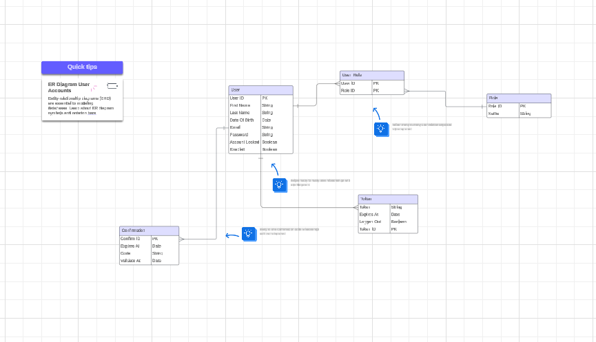

# Backend API Sales Management

## Table of Contents

- [Overview](#overview)
- [Features](#features)
- [Resources](#resources)
- [Technologies Used](#technologies-used)
    - [Backend](#backend)
- [Getting Started](#getting-started)
- [Acknowledgments](#acknowledgments)

## Overview

Sales Management is a full-stack application that enables users to manage their sales.

## Features

- User Registration: Users can register for a new account.
- Email Validation: Accounts are activated using secure email validation codes.
- User Authentication: Existing users can log in to their accounts securely.
- Forgot Password: Existing users can reset password to create new password.
- Sales Management: Users can create, update, and archive their sales.

## Resources

- ER Diagram User Account

## Technologies Used

### Backend

- Java
- Spring Boot
- Spring Data JPA
- Hibernate
- Java Mail Sender
- Thymeleaf
- PostgreSQL
- Pipeline CI/CD
- Docker

## Getting Started

To get started with the Book Social Network project, follow the setup instructions in the respective directories:

- [Backend Setup Instructions](README.md)

## Acknowledgments

Special thanks to the developers and maintainers of the technologies used in this project. Their hard work and dedication make projects like this possible.
